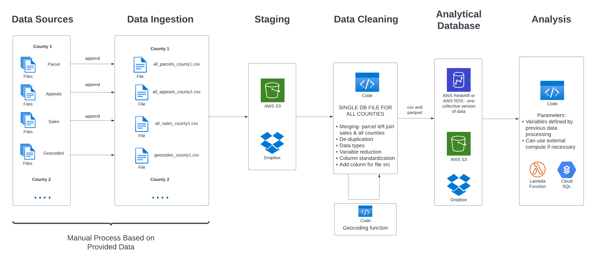

# Data Ingestion Process

This document details the Data Sources and Ingestion sections of the above diagram.
## Pre-Read Notes
This document is extensive, but very relevant to the exact work you will be doing. Please read through the entire document before beginning.

### Note on Step 1 and Step 2
You can chose to do Step 1 or Step 2 first (e.g. append then clean, or clean then append), but this is the suggested order.

If you chose to append then clean, you might notice that some variable names change, or are added or removed, over time. You may be able to avoid this by dropping unnecessary values before appending, even though this counts as cleaning/standardizing.

### Note on Formatting
If you doubt how you should name something, we are defaulting to snake case formatting.

Snake case means all words are lower case and spaces or separations become underscores.

Examples:
- A File Name -> a_file_name
- Parcel2011 -> parcel_2011

### Note on Reading in Files
Pandas allows you to specify which columns or variables you wish to read in from Excel or CSV formats. Declaring this process may increase the speed of reading in the file if that becomes a problem.

### Final File Names
Please follow the following format for output files.
- Final parcels file: all_parcels_{county_name}_{2011_2022}
- Final appeals file: all_appeals_{county_name}_{2011_2022}
- Final sales file: all_sales_{county_name}_{2011_2022}

You may change the years from 2011_2022 if that is not accurate for your data, but we are currently assuming we have those years for all counties.

The years should match the earliest and latest "Tax Year" in the given data.

### Note on Pandas and other DataFrame Libraries
Most data operations are NOT in place. This means it does not modify the data. Rather, it creates a new copy of the data with the given modification.

**Example**  
If you execute the following:
```python
df.fillna(0)
```
Then print the df, do not expect the Nulls to be equal to zero.  

Rather, you must replace the DataFrame with the new data, or create a new DataFrame:
```python
df = df.fillna(0)
```
### When You Need Help
Please create an issue in Github describing your issue, then notify Nick. This will allow us to keep a record of issues and learn from previous instances.


## 1. Combine (Append and/or Merge) all Given County Files of the Same Type

### Goal
A single file output for each type (parcels, appeals, sales) that contains all the data across time.

### Motivating Example
Given a county with parcel files labeled parcel2011, parcel2012,...,parcel2022, we want to create a new file containing all parcels from 2011-2022.

### Notes
- Appending should be computationally easier/faster than merging. As such, if you need to do both, I recommend merging first when the files are still broken up. If you run into memory issues, talk to Nick.
- If there are a lot of files you need to process, I would recommend trying to loop over them, rather than writing out each merge or append individually. See examples.

### Sub-Steps
1. OUTER MERGE FILES. If variables for the same type of data (e.g. parcels, appeals, sales) are spread over multiple files, OUTER merge them together to create a complete dataset for that year. You can ignore any files that do not contain relevant variables to our research- find these in "2. Clean and Standardize Data."  
When merging, it is important to note that you must do so on a key. A key can be multiple columns and represents the unique identifier for each row. This is important since say we have property address and characteristics in separate files. We want to merge the data for each property accurately. In most cases, it should be parcel id and tax year. If in doubt, ask.  
Ex: {Parcel_characteristics2011, Parcel_location2011,...} -> parcel_2011

2.  APPEND FILES. If files for the same type of data are split up into separate years, append them to create a complete dataset for all given years.  
Ex: {Parcel2011, Parcel2012,...} -> all_parcels

### Psuedo-Code Example and Code Suggestions
- Use the merge and append functions in Pandas. You may also want to use the concat function for appending many files at once. If using Polars, you can use join, concat, or vstack.

**Merging**
```python
df1.merge(
    df2,
    on='{key}',
    how='{outer, inner, left,...}'
)
```
See Pandas documentation for more details. Find more details about inner, outer, and left joins [here](https://www.freecodecamp.org/news/sql-join-types-inner-join-vs-outer-join-example/#:~:text=The%20biggest%20difference%20between%20an,table%20in%20the%20resulting%20table.), if desired. Merges are the same as joins.  
Note: we want to use OUTER join here.

**Appending**
```python
df1.append(df2, ignore_index=True)
```
You may need to ignore index, as shown above. See Pandas documentation for more details.

**Concat**
```python
pd.concat([df1, df2, df3,...], ignore_index=True)
```
You may need to ignore index, as shown above. See Pandas documentation for more details.

## 2. Clean and Standardize Data
See this [spreadsheet](https://gtvault-my.sharepoint.com/:x:/g/personal/yan74_gatech_edu/EdZML-yafpFGhiyYvTXRgX8Birr030P1b4cXjW4SxDaL2A?e=j5gu94) for information regarding data standardization for each variable.

### Goal
We want all final output files to have the same data standards- this means having the same variable names, data types, and data cleaning process.

### Motivating Example
Given a column named 'salesprice', we want to:
- Rename the column 'sales_price'
- Find any rows where the value is not correct, e.g. a negative number or contains letters, etc. If they are insignificant (<5% of total), delete such rows. Do not delete rows where they are empty.
- Cast the datatype from String to Float32. This may require you to remove all the commas for conversion to work, ex: "1,000.00" - > "1000.00".

### Notes
- When reading files, Pandas reads in every column as an 'object' datatype. This is a general datatype for representing any data but is very inefficient. It is possible to declare the datatypes for each variable upon reading in the file. However, this is not recommended as it will cause an error and not read in the file if values cannot be converted to that datatype.
- Try casting to the given data type before trying to identify rows with incorrect values. You will get an error that provides an example row where the conversion could not occur. Correct these until it works.
- Please note all atypical cleaning steps in this [document](https://gtvault-my.sharepoint.com/:w:/g/personal/yan74_gatech_edu/EePWeLghsP5MiBbEJqNLZfoBvQg3l4_3rRZTwamZ1KDQ4g?e=9LZPgZ). Typical cleaning steps might include stripping all commas from sales price strings. Atypical cleaning might include replacing all Null sales price with -1. Essentially, make a note of any cleaning that would not be implied. Simply list the county, the variable, and the cleaning steps involved.

### Sub-Steps
1. RENAME COLUMNS. Rename the columns given the data standardization spreadsheet. Record the original column name in the spreadsheet.
2. ATTEMPT CAST TO DESIRED DATATYPE. Attempt to cast the column to the desired datatype. If this works successfully, you may not have any data inconsistencies for that variable. You should briefly investigate if there may be some (e.g. 'tax_year' can be casted to Int16 even if it has negative values despite that being an "incorrect value" in our case). Tips are suggested in the Code section.
3. REPLACE NULL (CALLED 'NONE' IN PYTHON). If there are empty values for your variable, replace them with something that indicates they are incorrect without invalidating the desired datatype. For instance, if sales price has empty values, replace those with -1.
4. CLEAN INCONSISTENCIES. Find and delete values that are incorrect. Or, if there is a pattern to these inconsistencies, fix them. For instance, zip codes that begin with 0 might have 0 excluded. These zip codes do not appear valid as they are 4 digits instead of 5, but manually checking some of them reveals that the address they refer to simply has a 0 as the first zip code digit.
5. FINISH CAST TO DESIRED DATATYPE.

### Psuedo-Code Example and Code Suggestions
**Renaming**
```python
df.rename(columns={"saleyear": "sale_year"})
```
**Casting**
```python
df.astype('int32')
```
```python
df.astype('category')
```
**Replace Nulls**
```python
df = df[df['sales_price'].fillna(-1)]
```
If you have a replacement that is not straightforward, contact Nick.

**Find Percent of Data Given Filter**
```python
len(df[df['sales_price'] == -1])/len(df) * 100
```

**Identifying Incorrect Values**  
- Filtering:
```python
df = df[df['sale_year'] > 2010]
```
- Complex Patterns (Likely Need Regex):  
Regex, short for Regular Expression, is a pattern-matching language integrated into most programming languages. Pandas allows you to identify rows based on Regex. In the example below, we are finding sales price rows that contain letters, then taking the opposite, which would be correct rows (without letters). The '~' operator means NOT or OPPOSITE.
```python
df = df[~df['sales_price'].str.contains('[A-Za-z]')]
```
If you need to use Regex, use this [website](https://regex101.com/) to construct your search pattern.

**View Datatypes**
```python
df.info()
```
**Quickly Find Outliers**
```python
df.describe()
```

## 3. Export Data
Yay! You're almost there.

We will be exporting twice- once to CSV and once to Parquet. 

Parquet is an efficient file format for big data, but it is not viewable through Excel, etc. It must be read in with a programming language. It maintains the data types that we defined previously, whereas CSV does not. It may take longer to write the file.

```python
df.to_csv(filename, index=False)
```
We don't need the index written to the CSV.

```python
df.to_parquet(filename, index=True)
```
Indexes for Parquet are different. We want these.

Once you have these files, upload them to the [OneDrive](https://gtvault-my.sharepoint.com/personal/yan74_gatech_edu/_layouts/15/onedrive.aspx?e=5%3A3fa2b70cc6bf45b8a2c2d5088b912932&fromShare=true&at=9&cid=6ef121a1%2D97ff%2D47d1%2D9433%2Ddf30bbde2f55&id=%2Fpersonal%2Fyan74%5Fgatech%5Fedu%2FDocuments%2FCounty%20Tax%20Assessment%20Data%2FDatasets%20cleaned%20and%20merged&FolderCTID=0x012000C4C8C88DF99687429B5EC8C301637C31&view=0) in a output folder for your county.